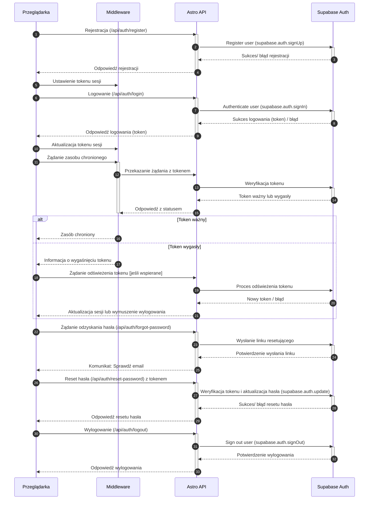

```mermaid
sequenceDiagram
    autonumber
    participant Browser as Przeglądarka
    participant Middleware as Middleware
    participant API as Astro API
    participant Auth as Supabase Auth

    %% Rejestracja
    Browser->>API: Rejestracja (/api/auth/register)
    activate API
    API->>Auth: Register user (supabase.auth.signUp)
    activate Auth
    Auth-->>API: Sukces/ błąd rejestracji
    deactivate Auth
    API-->>Browser: Odpowiedź rejestracji
    deactivate API
    Browser->>Middleware: Ustawienie tokenu sesji

    %% Logowanie
    Browser->>API: Logowanie (/api/auth/login)
    activate API
    API->>Auth: Authenticate user (supabase.auth.signIn)
    activate Auth
    Auth-->>API: Sukces logowania (token) / błąd
    deactivate Auth
    API-->>Browser: Odpowiedź logowania (token)
    deactivate API
    Browser->>Middleware: Aktualizacja tokenu sesji

    %% Weryfikacja tokenu przy dostępie do zasobu chronionego
    Browser->>Middleware: Żądanie zasobu chronionego
    activate Middleware
    Middleware->>API: Przekazanie żądania z tokenem
    API->>Auth: Weryfikacja tokenu
    activate Auth
    Auth-->>API: Token ważny lub wygasły
    deactivate Auth
    API-->>Middleware: Odpowiedź z statusem
    deactivate Middleware
    alt Token ważny
      Middleware-->>Browser: Zasób chroniony
    else Token wygasły
      Middleware-->>Browser: Informacja o wygaśnięciu tokenu
      Browser->>API: Żądanie odświeżenia tokenu [jeśli wspierane]
      API->>Auth: Proces odświeżenia tokenu
      Auth-->>API: Nowy token / błąd
      API-->>Browser: Aktualizacja sesji lub wymuszenie wylogowania
    end

    %% Zapomniane hasło
    Browser->>API: Żądanie odzyskania hasła (/api/auth/forgot-password)
    activate API
    API->>Auth: Wysłanie linku resetującego
    activate Auth
    Auth-->>API: Potwierdzenie wysłania linku
    deactivate Auth
    API-->>Browser: Komunikat: Sprawdź email
    deactivate API

    %% Reset hasła
    Browser->>API: Reset hasła (/api/auth/reset-password) z tokenem
    activate API
    API->>Auth: Weryfikacja tokenu i aktualizacja hasła (supabase.auth.update)
    activate Auth
    Auth-->>API: Sukces/ błąd resetu hasła
    deactivate Auth
    API-->>Browser: Odpowiedź resetu hasła
    deactivate API

    %% Wylogowanie
    Browser->>API: Wylogowanie (/api/auth/logout)
    activate API
    API->>Auth: Sign out user (supabase.auth.signOut)
    activate Auth
    Auth-->>API: Potwierdzenie wylogowania
    deactivate Auth
    API-->>Browser: Odpowiedź wylogowania
    deactivate API
``` 