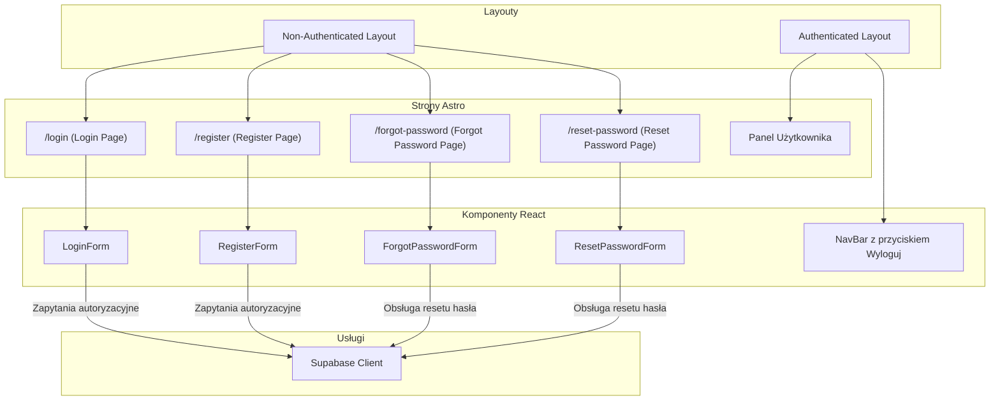

```mermaid
flowchart TD
    %% Layout Section
    subgraph "Layouty"
        AL["Authenticated Layout"]
        NAL["Non-Authenticated Layout"]
    end

    %% Astro Pages
    subgraph "Strony Astro"
        LP["/login (Login Page)"]
        RP["/register (Register Page)"]
        FP["/forgot-password (Forgot Password Page)"]
        RTP["/reset-password (Reset Password Page)"]
        PU["Panel Użytkownika"]
    end

    %% React Components
    subgraph "Komponenty React"
        LF["LoginForm"]
        RF["RegisterForm"]
        FF["ForgotPasswordForm"]
        RPF["ResetPasswordForm"]
        NB["NavBar z przyciskiem Wyloguj"]
    end

    %% Wspólne Usługi
    subgraph "Usługi"
        SC["Supabase Client"]
    end

    %% Powiązania między Layoutami a Stronami Astro
    NAL --> LP
    NAL --> RP
    NAL --> FP
    NAL --> RTP
    AL --> PU
    AL --> NB

    %% Powiązania między stronami a komponentami React
    LP --> LF
    RP --> RF
    FP --> FF
    RTP --> RPF

    %% Komponenty React komunikują się z Supabase Client
    LF -- "Zapytania autoryzacyjne" --> SC
    RF -- "Zapytania autoryzacyjne" --> SC
    FF -- "Obsługa resetu hasła" --> SC
    RPF -- "Obsługa resetu hasła" --> SC
``` 